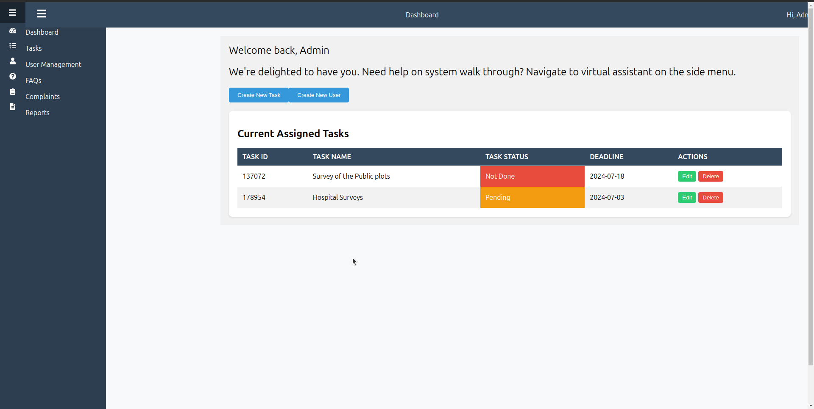

# Project Management System

This project is a comprehensive Project Management System designed for administrative use, offering functionalities such as task management, user management, and complaint handling. The system includes a responsive sidebar and top bar navigation to ensure a seamless user experience.

## Table of Contents

- [Demo](#demo)
- [Features](#features)
- [Technologies Used](#technologies-used)
- [Installation](#installation)
- [Usage](#usage)
- [File Structure](#file-structure)
- [Contributing](#contributing)
- [License](#license)
- [Contact](#contact)

## Demo



## Features

- **Responsive Sidebar Navigation**: Collapsible sidebar with icons and text.
- **Task Management**: Create, update, and delete tasks with status indicators.
- **User Management**: Manage users, including adding and editing user information.
- **Complaint Handling**: Submit and view complaints with status updates.
- **Top Bar Navigation**: Includes user dropdown and navigation toggle button.
- **Local Storage**: Saves tasks and users in local storage for persistence.

## Technologies Used

- **React**: Front-end library for building user interfaces.
- **Styled-Components**: For component-level styling.
- **React Router**: For routing and navigation.
- **React Icons**: For adding icons to the UI.

## Installation

Follow these steps to set up the project locally:

1. **Clone the repository**:
    ```sh
    git clone https://github.com/yourusername/project-management-system.git - NO CLONING
    ```

2. **Navigate to the project directory**:
    ```sh
    cd project-management-system
    ```

3. **Install dependencies**:
    ```sh
    npm install
    ```

## Usage

To run the project locally, use the following command:

```sh
npm start
```

This will start the development server and open the project in your default web browser. You can access the project at `http://localhost:3000`.

## File Structure

```
project-management-system/
├── public/
│   ├── index.html
│   └── ...
├── src/
│   ├── components/
│   │   ├── Sidebar.js
│   │   ├── TopBar.js
│   │   ├── TaskForm.js
│   │   ├── UserForm.js
│   │   ├── ComplaintForm.js
│   │   ├── ComplaintList.js
│   │   └── ComplaintDetails.js
│   ├── pages/
│   │   ├── AdminDashboard.js
│   │   ├── UserManagement.js
│   │   ├── ComplaintsPage.js
│   │   └── ...
│   ├── App.js
│   ├── index.js
│   └── ...
├── tasks.json
├── users.json
├── README.md
├── package.json
└── ...
```

## Contributing

We welcome contributions to enhance the project. To contribute, follow these steps:

1. **Fork the repository**.
2. **Create a new branch**:
    ```sh
    git checkout -b feature-branch
    ```
3. **Make your changes and commit them**:
    ```sh
    git commit -m "Add new feature"
    ```
4. **Push to the branch**:
    ```sh
    git push origin feature-branch
    ```
5. **Create a pull request**.

## License

This project is licensed under the MIT License. See the [LICENSE](LICENSE) file for more details.

## Contact

For any inquiries or feedback, feel free to contact us:

- **Email**: your.email@example.com  - HIDDEN
- **GitHub**: [yourusername](https://github.com/yourusername)  - HIDDEN